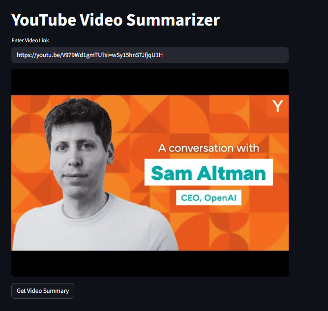

# 📺 YouTube Video Summarizer

A simple and powerful web app that summarizes YouTube videos using their transcripts. Built with **Streamlit** and powered by **Google Gemini** (Gemini 1.5 Flash), this tool extracts the transcript from a YouTube video and condenses it into a concise bullet-point summary within 250 words.

---

## 🚀 Features

- ✅ Automatically extracts transcripts from YouTube videos  
- 🤖 Uses Google's **Gemini AI** to generate a high-quality summary  
- 📌 Summary limited to the most important points (≤250 words)  
- 🖼️ Displays thumbnail preview of the video  
- 🧠 Zero manual transcript copy-pasting  

---

## 🛠️ Tech Stack

- **Frontend/UI**: [Streamlit](https://streamlit.io/)  
- **AI Model**: Google Gemini (via `google.generativeai`)  
- **Transcript API**: [YouTube Transcript API](https://pypi.org/project/youtube-transcript-api/)  
- **Environment Management**: `python-dotenv`  

---

## 📦 Installation

1. **Clone the repo**

```bash
git clone <repository-url>
cd <repository-folder>
```

2. **Install dependencies**

```bash
pip install -r requirements.txt
```

3. **Set up environment variables**

Create a `.env` file in the root directory and add your Google API key:

```env
GOOGLE_API_KEY=your_google_gemini_api_key_here
```

4. **Run the app**

```bash
streamlit run app.py
```

---

## ✨ Usage

1. Paste any YouTube video link (ensure it has captions available).
2. Click on **"Get Video Summary"**.
3. Read the summary and enjoy the key insights!

---

## 🔒 Requirements

- Python 3.7+
- Valid [Google Gemini API key](https://aistudio.google.com/app/apikey)

---

## 📷 Example

)  

---

## ❗ Troubleshooting

- If you get an error saying `Could not retrieve transcript`, the video might not have captions available or might be region-locked.
- Ensure the API key is valid and you have access to Gemini models.

---

## 📄 License

MIT License

---

## 🙌 Acknowledgements

- [Streamlit](https://streamlit.io/)
- [YouTube Transcript API](https://pypi.org/project/youtube-transcript-api/)
- [Google Generative AI](https://ai.google.dev/)
